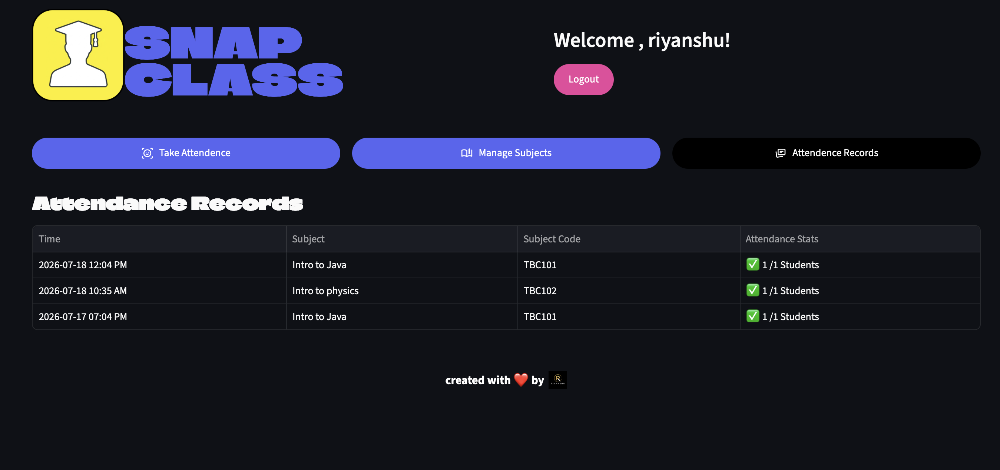
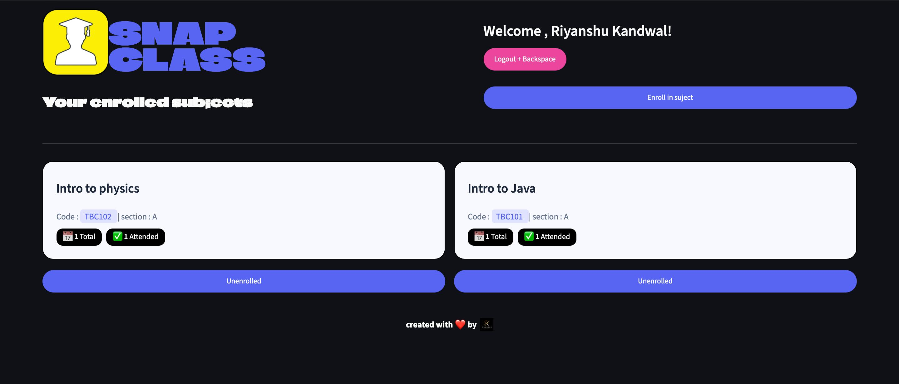
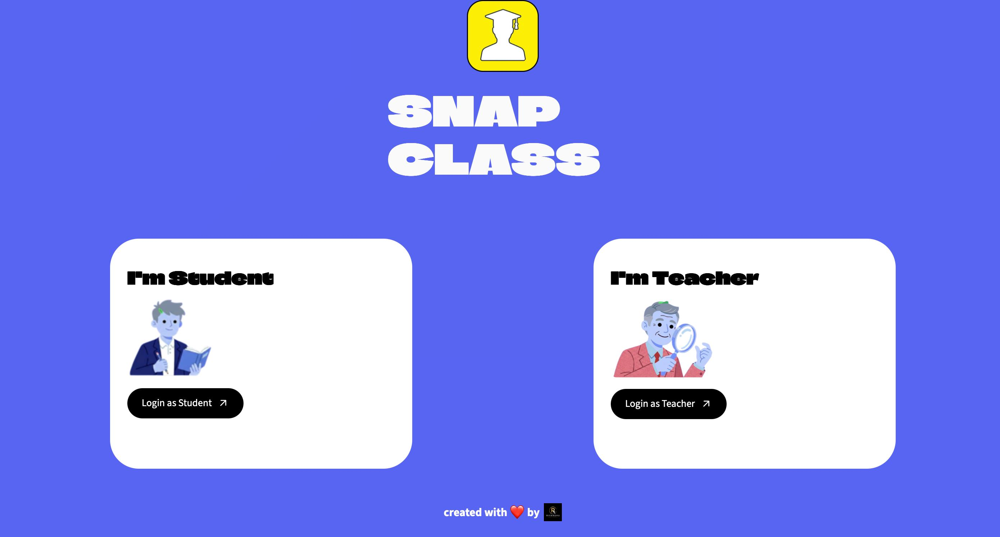
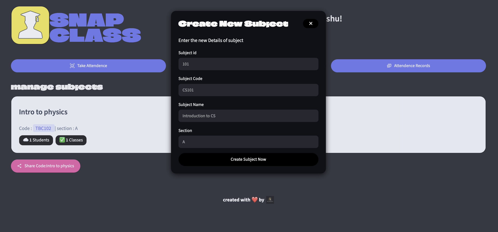
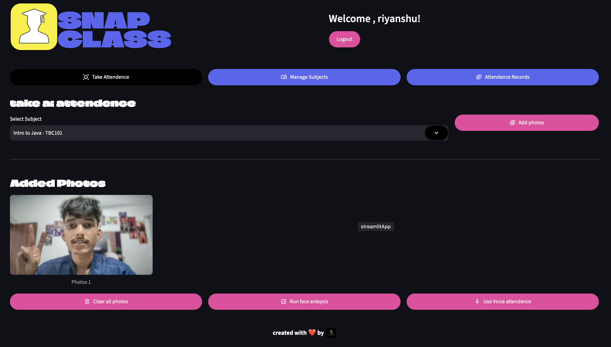

# 🎓 SnapClass AI

An AI-powered attendance management system that uses **Face Recognition** and **Voice Recognition** to automate attendance for educational institutions. Built with **Streamlit**, **OpenCV**, **dlib**, **Resemblyzer**, and **Supabase**.

## 🌐 Live Demo

🔗 https://snapclass-main-riyanshu.streamlit.app

## 📸 Application Preview

<table>
<tr>
<td align="center"><b>Home Page</b></td>
<td align="center"><b>Teacher Dashboard</b></td>
</tr>

<tr>
<td></td>
<td></td>
</tr>

<tr>
<td align="center"><b>Manage Subjects</b></td>
<td align="center"><b>Attendance Records</b></td>
</tr>

<tr>
<td></td>
<td></td>
</tr>

<tr>
<td align="center"><b>Student Dashboard</b></td>
<td align="center"><b>Face Login</b></td>
</tr>

<tr>
<td></td>
<td></td>
</tr>
</table>

---

## ✨ Features

- 👤 AI-powered Face Recognition
- 🎙️ Voice Recognition Attendance
- 👨‍🏫 Teacher & Student Dashboards
- 📚 Subject Management
- 📊 Attendance Tracking
- ☁️ Supabase Integration
- ⚡ Interactive Streamlit UI

---

## 🛠️ Tech Stack

- Python
- Streamlit
- OpenCV
- dlib
- Resemblyzer
- Supabase
- NumPy
- Pandas

---

## 📂 Project Structure

```text
snapclass/
├── assets/
│   ├── 1.png
│   ├── 2.png
│   ├── 3.png
│   ├── 7.png
│   ├── 8.png
│   └── 9.png
├── src/
│   ├── components/
│   │   ├── dialog_attendence_result.py
│   │   ├── dialog_auto_enroll.py
│   │   ├── dialog_enroll.py
│   │   ├── dialog_photo_add.py
│   │   ├── dialog_voice_attendence.py
│   │   ├── dialogue_create_subject.py
│   │   ├── dialogue_share_subject.py
│   │   ├── footer.py
│   │   ├── home_header.py
│   │   └── subject_card.py
│   ├── database/
│   │   ├── config.py
│   │   └── db.py
│   ├── images/
│   │   ├── mascot-teacher.png
│   │   └── rk.png
│   ├── pipelines/
│   │   ├── face_pipeline.py
│   │   └── voice_pipeline.py
│   ├── screens/
│   │   ├── home_screen.py
│   │   ├── student_screen.py
│   │   └── teacher_screen.py
│   └── ui/
│       └── base_layout.py
├── .streamlit/
├── main.py
├── requirements.txt
├── README.md
└── .gitignore
```

---

## ⚙️ Run Locally

```bash
git clone https://github.com/Riyanshu-07/snapclass-main-riyanshu.git

cd snapclass

python -m venv venv

# Windows
venv\Scripts\activate

# macOS/Linux
source venv/bin/activate

pip install -r requirements.txt

streamlit run main.py
```

---

## 👨‍💻 Author

**Riyanshu Kandwal**

- GitHub: https://github.com/Riyanshu-07
- LinkedIn: https://www.linkedin.com/in/riyanshu-kandwal-555433309

---

⭐ If you found this project useful, consider giving it a star!
